One of the great things about the ruby programmer community is our hacker mentality; we will either find a way or create one in order to accomplish the goals we set for our projects. In this tutorial, I will be sharing a little treasure that I’ve used in a few of my projects to help me manage the status of my applications in pseudo­-real-­time no matter how far I am from my computer. I’ve noticed that as the number of projects I take part in grows, the number of emails in my inbox grow as well. Email alerts in my inbox tend to go unnoticed amid the noise of work emails, personal emails and spam that the world pelts me with every day.

So I created a little module that I can easily include in any of my ruby scripts to send me text alerts whenever certain conditions are met at runtime. It’s not as glamorous as some paid services (like Twilio), but it’s completely free and gets the job done with just a slight bit of effort. Let’s get started! My tutorial will be completed entirely using Cloud9 IDE, my favorite development environment in the cloud. It’s very robust, and it allows me to work from whichever computer I’m close to. The biggest advantage is that I don’t have to employ hours worth of setup and configuration. If you don’t have an account, [you can register for free here](https://c9.io/web/sign-up/free).

Once you’ve registered and clicked on the “Dashboard” button, you will be taken to your personal dashboard, the screen where you can find all of your public workspaces. You’re allowed unlimited public workspaces on the free plan, so code away! Simply click the “Create New Workspace” button on the top left, create a title for the project and select the “Custom” workspace option at the bottom right of the setup pane. There are 9 different coding languages/frameworks that Cloud9 supports and will automatically setup/configure for you, as shown in this setup pane. Since we’re working with plain ole vanilla Ruby, we don’t need any of these features.

[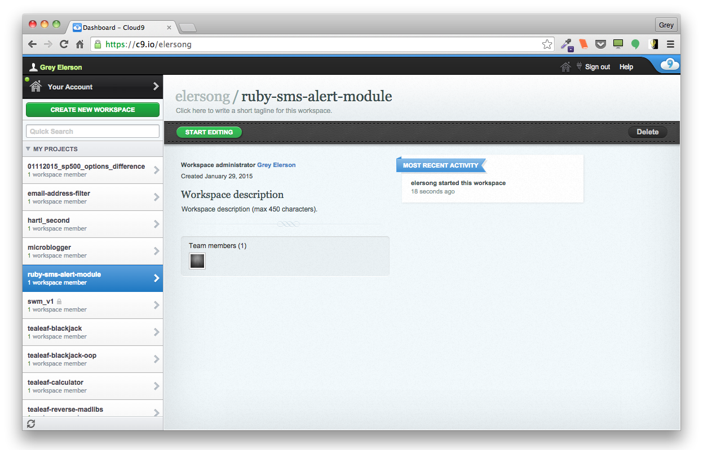](assets/Screen-shot-2015-01-29-at-8.15.26-PM.png)

**QUICK SIDE-NOTE:** _If, at any point, you find the screenshots difficult to read, you can click on the image to make it bigger. There is a larger, more high-quality image that's very easy to read. Now back to "your regularly scheduled programming."_

Once you’ve clicked the “Create” button, it will take a few moments for the workspace to be ready in your “My Projects” sidebar within the dashboard. When you can click on it, the workspace is ready. Click on the name of the workspace and then click the “Start Editing” button to open up the development environment in a new tab. Each workspace is initiated with a `readme.md` markdown file to encourage developers to use best practices. Let’s take the hint and update the file with a little descriptive information about the project.

[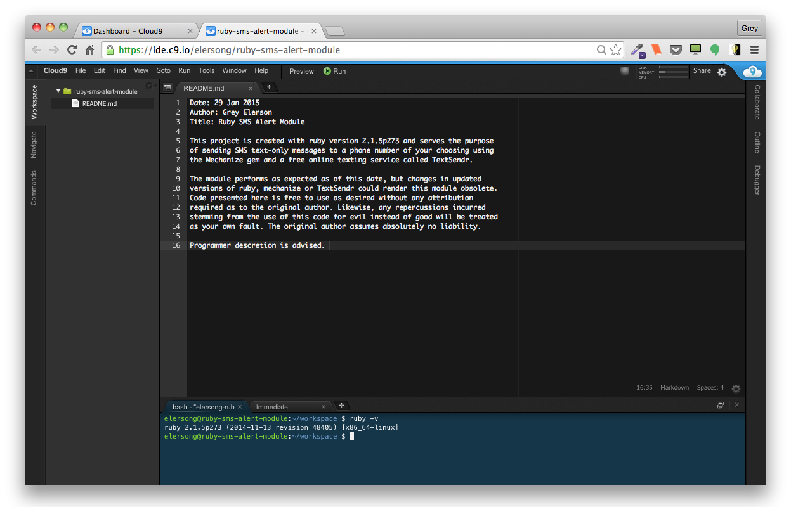](assets/Screen-shot-2015-01-29-at-8.24.09-PM.png)

Also in keeping with ruby best practices, let’s update the workspace settings to use soft tabs (with 2 spaces) instead of hard tabs by clicking the gear icon in the top right corner of the workspace beside the Cloud9 icon. This is where all of the settings for this specific project are kept, but we don’t need to look into any other settings in the scope of this tutorial.

[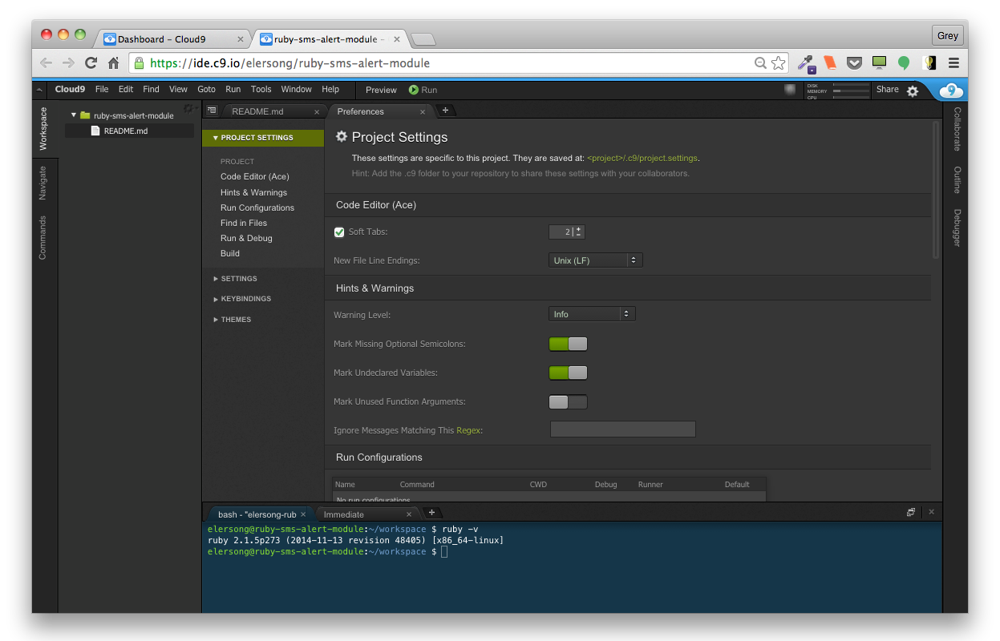](assets/Screen-shot-2015-01-29-at-8.37.51-PM.png)

Let’s begin by creating the ruby file where all of our code will be housed. I’m going to call it `notifysms.rb` for obvious reasons. Within this file, we’ll write some pseudocode to describe the end functionality of the module, since this tutorial isn’t going to go as far as writing tests to verify functionality. You should see a small notification at the top of the screen that Cloud9 has auto­saved your workstation after every change you make to your code.

[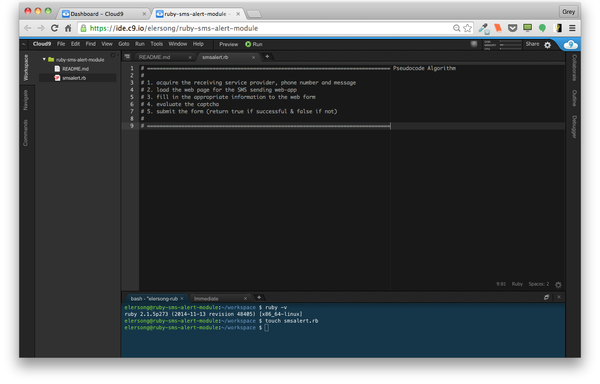](assets/Screen-shot-2015-02-03-at-1.16.17-PM.png)

For the purposes of this project, we will be interfacing with a web­based tool for sending SMS messages for free through the browser, called “TextSendr”. [You can find it here](http://textsendr.com)​. The application is currently online and available to use by anyone who agrees not to use it with malicious intent for threatening or spamming the end user. Please respect that policy. With that in mind, we can see that the interface is actually very simple. It uses only a single form that asks for the information we covered in our pseudocode with one addition­­ the email address of the sender. This is to identify where the message came from, and won’t be a problem for us to include.

[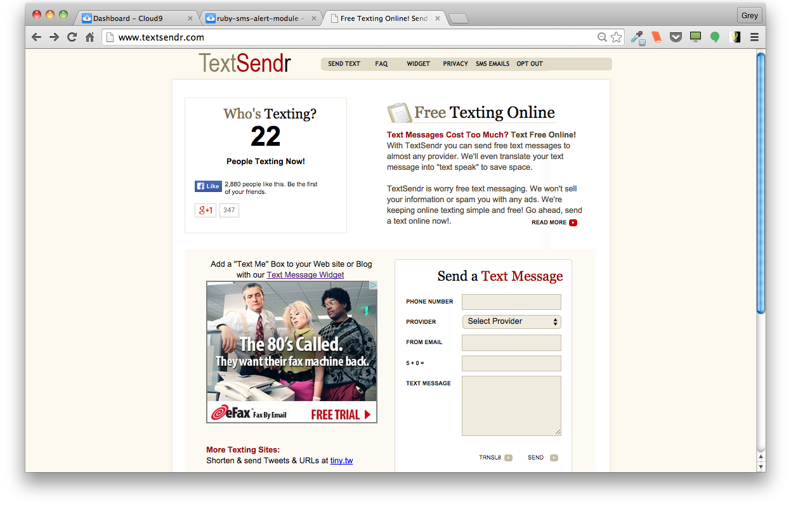](assets/Screen-shot-2015-02-03-at-2.02.22-PM.png)

To accomplish our goal, we’ll need only a few concise methods to cover the major functionality of the module. Let’s keep things simple and only make one method available to the user, the `NotifySMS.send` method. In order to accomplish the sending task, we’ll need a way to track the information for sending. We can accomplish that through getter/setter methods to set module-­class-­variables. And finally, we’ll need a workflow for connecting to the application as well as solving their simple captcha; we’ll mark these as `private` methods, since the user will have no reason to interact with them.

[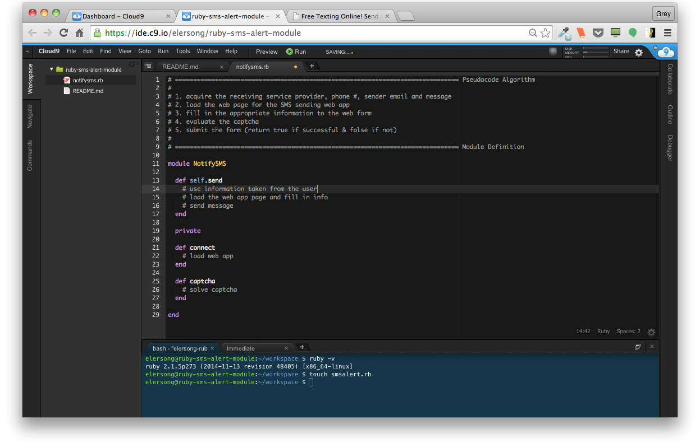](assets/Screen-shot-2015-02-03-at-2.13.19-PM.png)

Let’s begin by collecting the send information from the user. Since we want to encapsulate state information about the message within the module, we will have to use class variables. Modules, unlike classes, cannot be instantiated; that means that we can’t use instance variables. Unfortunately, the handy little `attr_accessor` method in ruby requires instance variables instead of class variables, so we need to define getter and setter methods for each attribute of information. I’ve minimized most of the definitions to save on space, but they all follow the same structure as the first getter/setter method displayed. Keep in mind that none of this information is validated, so it’s up to the user to make sure that all the information he/she provides is correct.

[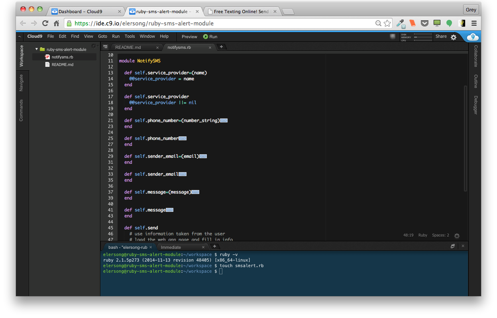](assets/Screen-shot-2015-02-03-at-2.45.06-PM.png)

Now that we have a way to organize the information needed to prepare a message for sending, let’s start the workflow for interacting with the TextSendr website using mechanize. If you’ve never used mechanize before, [you can learn everything you need to know for this project here](http://ruby.bastardsbook.com/chapters/mechanize/)​. If you’re inquisitive, like me, you can learn a bit more by [watching the ​railscast](http://railscasts.com/episodes/191­mechanize) or [reading the documentation here](http://docs.seattlerb.org/mechanize/)​.

In order to use the mechanize gem to interact with live websites (rather than html documents hosted on our localhost), we’ll also need to include a dependency, open­uri. Run `gem install mechanize` in the terminal and include both gems inside the module.

[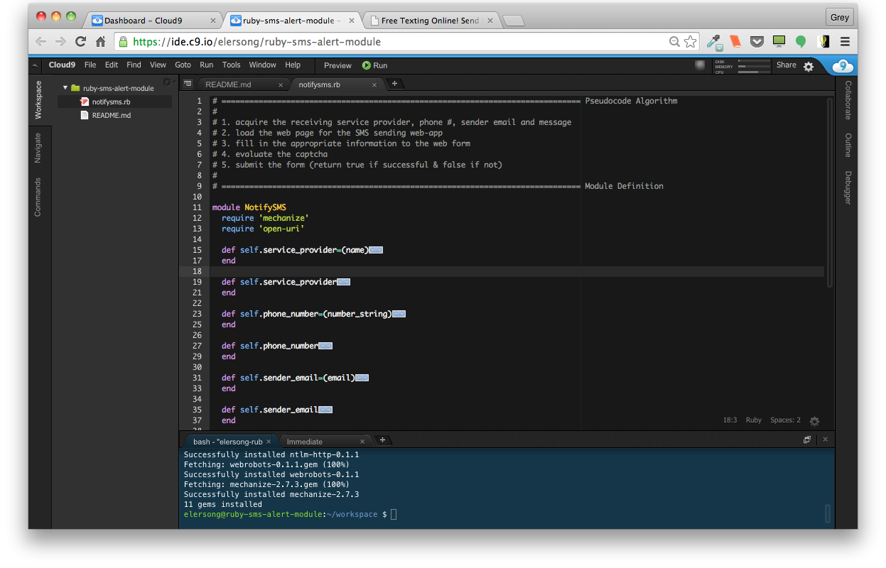](assets/Screen-shot-2015-02-03-at-3.54.36-PM.png)

We are now prepared to develop in the `connect` method to pull in the submission page from TextSendr and fill in the form with our information. Let’s write in some extra code at the bottom of our file to output the webpage structure to the terminal, and then we can run our file. We will need to comment out the `private` keyword so that we can access the `connect` method.

[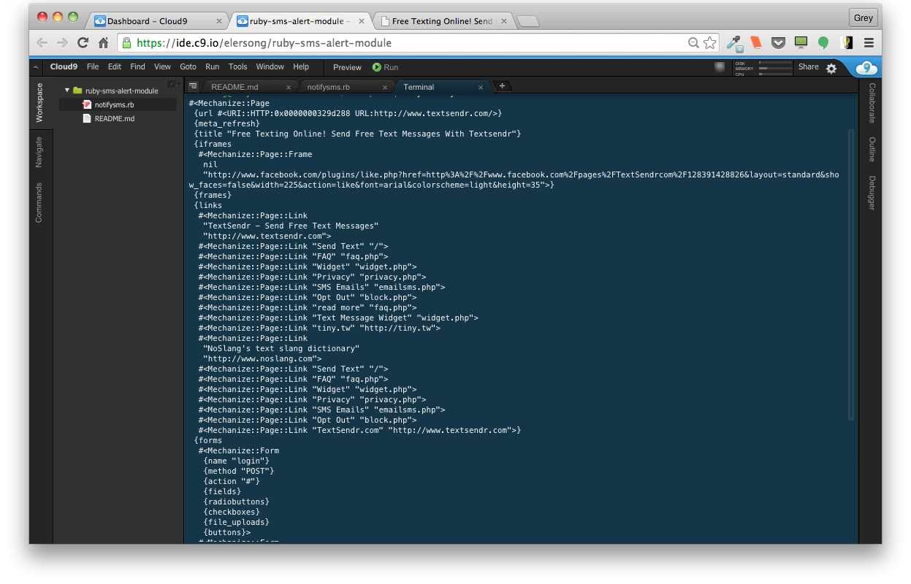](assets/Screen-shot-2015-02-03-at-4.11.04-PM.png)

[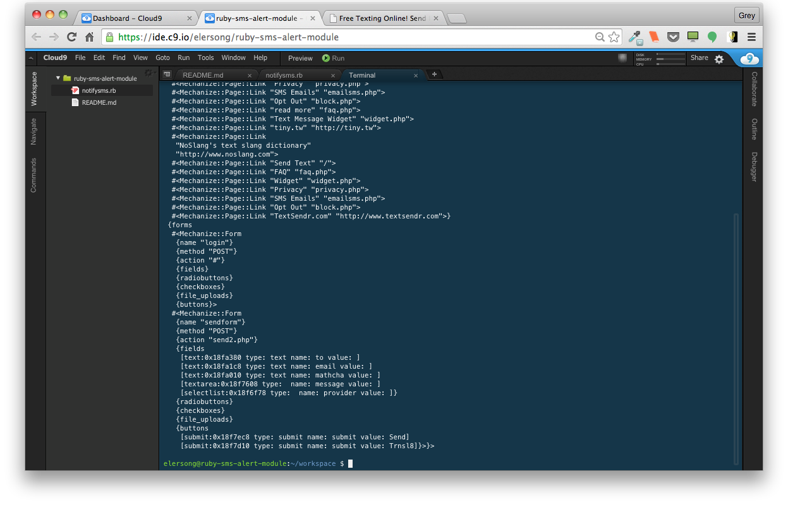](assets/Screen-shot-2015-02-03-at-4.11.08-PM.png)

You can see that our code pretty­printed the Mechanize object to the screen that was returned from parsing the url that we fed the `get` function. Most of this information is irrelevant for our purposes, but at the bottom, we can see that mechanize has graciously arranged all of the forms on the page into an array for us. The first form object is the login form, which we can tell because its `name` attribute is set to “login.” When we look at the second form, however, we can see that it has all of the correct inputs, so that’s the one we’re after. Let’s save that form to a convenient handle in the method so we can access it without doing a lot of typing.

[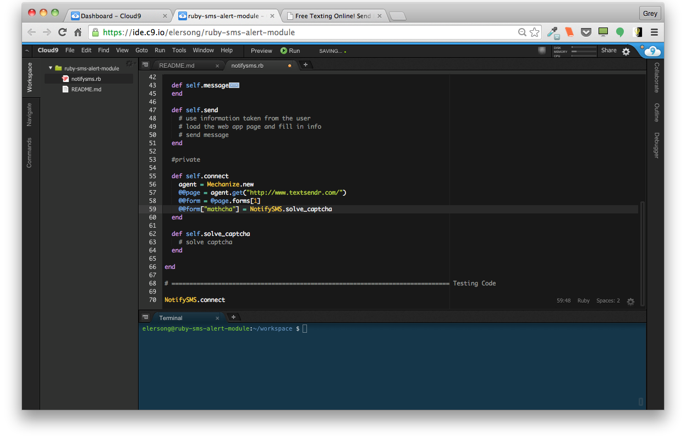](assets/Screen-shot-2015-02-03-at-7.45.34-PM.png)

We can easily fill in text input elements, but there are two challenges that we will have to overcome in order to successfully send this message. First, we will need to iterate through the select element in order to choose the appropriate SMS service provider. Second, we will need to somehow access the content for the label on the mathcha (math-­based captcha).

In order to “connect” to the TextSendr application, we want to download and parse the page into a mechanize object. We then want to save the form of interest out of that object into a class variable. Finally, we want to go ahead and take care of the captcha automatically when the page is loaded.

I need to take a moment to thank [Syed Sana Hassan](http://hackhands.com/syedhassan) for designing the `solve_captcha` method. I ran into an issue with parsing the html of the page that we feed into mechanize, and Syed had no issue accomplishing exactly what I needed in a really short amount of time. Here is how he explained to me that this method works. The `search` method will parse the html response from the GET request we sent in the `connect` method in order to find an element that is a regex match that we specify (a form label that is aligned right). We then pass that entire element’s text contents into the scan method, which will return only the text that matches another regex that we specify. In this case, it’s looking for any text that is one or more consecutive digits and nothing else. Finally, we add those digits together and return the value converted to a string. In the illustrating image, I’ve formatted a few prints to the console to show that the method is working as expected.

[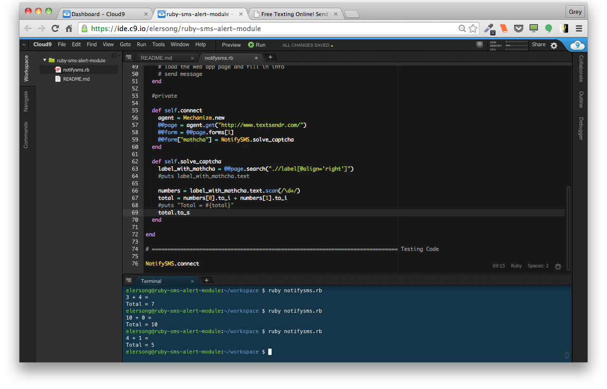](assets/Screen-shot-2015-02-03-at-10.45.29-PM.png)

Finally, we need to handle the select element within the form, used for identifying the receiving device’s service provider. This is a bit tricky, since we can’t see what the selectable elements are when we print the mechanize object to the console. Thankfully, another ruby developer named David Sulc had this problem as well, and he published his solution. [You can find his original blog post here](http://davidsulc.com/blog/2011/11/20/selecting-an-option-from-dropdown-form-fields-with-mechanize/). Rather than reinvent the wheel, we’re going to use his method with a few minor adaptations. The version displayed here will match carrier names regardless of capitalization, so long as it’s spelled correctly. We achieve this by iterating through all of the options in the element and matching each element against the options. If one fits, we select it; otherwise, we raise a nicely formatted error.

[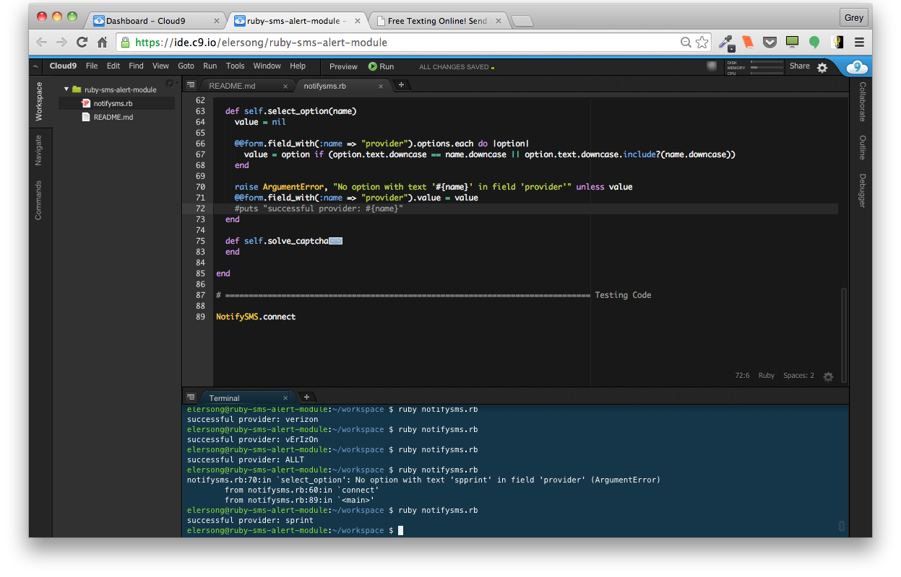](assets/Screen-shot-2015-02-03-at-11.50.47-PM.png)

At this point, we could release this to the wild with the expectation that the user will always keep the proper usage in mind when sending notifications. However, an experienced programmer knows that to be a foolish assumption. But what could we do to improve the usability of this already-­perfect module? For starters, the module should raise an error when the user tries to send a notification without providing all the necessary information. Second, we might consider that, in the context of this module, there will only be one phone number to which messages are sent. These will presumably be sent to the developer. We can provide for this case by saving the phone number to a constant, and we can alter the functionality of the module based on whether or not that constant has been updated from the default.

[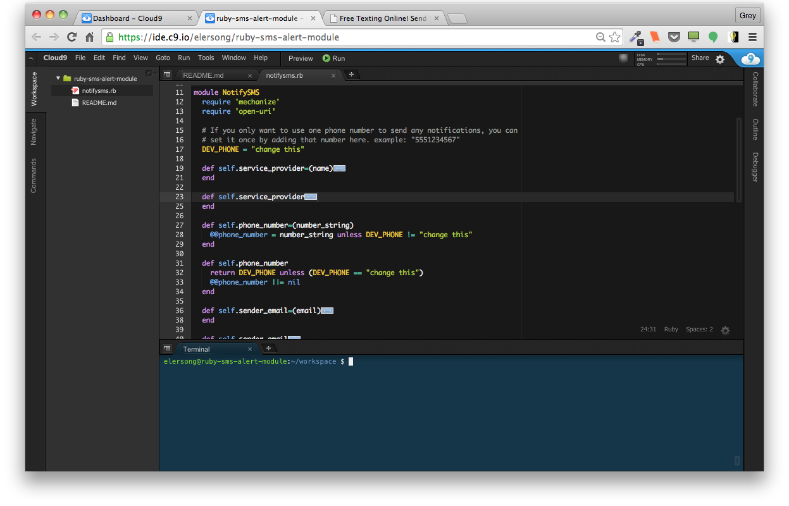](assets/Screen-shot-2015-02-04-at-5.10.40-PM.png)

We can keep with ruby best practices by simplifying the `connect` method to only include functionality that’s necessary to connect to the web form. Since the user isn’t interacting with the captcha, we can include that in the method. We can move the other functionality to an if/else statement in the `send` method, because it is better suited to sending the message rather than connecting with the form. Now, all we need is a method to check if all the necessary attributes have been set. Let’s name it `ready?` and have it return a boolean.

[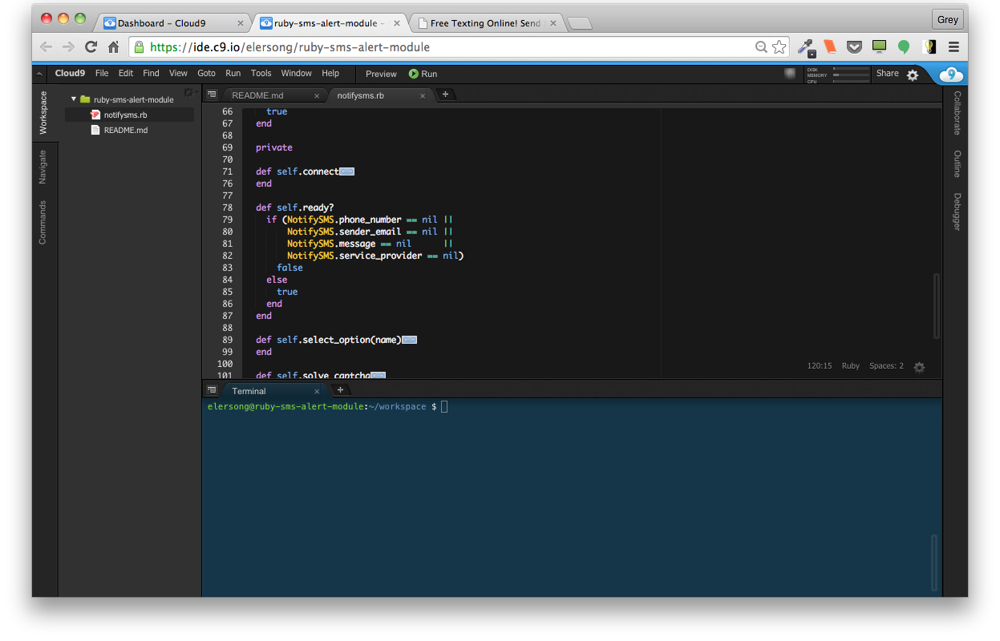](assets/Screen-shot-2015-02-06-at-7.20.20-PM.png)

The only thing left to do is pull it all together inside the `send` method. Now would be a great time to update the readme file to reflect the changes to the module since we started. From there, we’re ready to take this module for a test drive! I put a simple test message setup at the bottom of the file.

[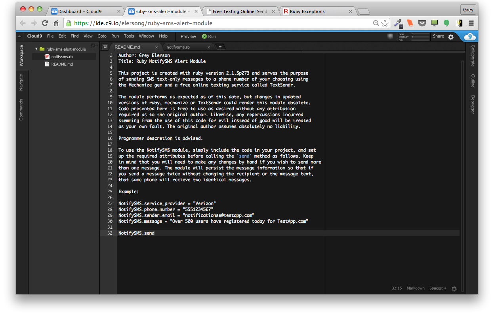](assets/Screen-shot-2015-02-05-at-4.36.57-PM.png)

[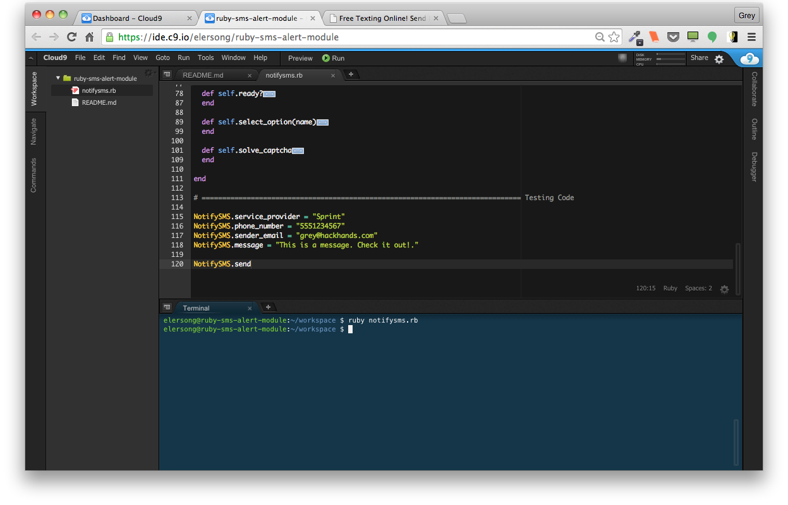](assets/Screen-shot-2015-02-06-at-6.48.24-PM.png)

There’s no way to get rid of the shameless plug for TextSendr or the IP address of the computer from which the message was sent. But that’s easy to become okay with, since we’re leveraging their service for free. If you had any trouble following along with the tutorial, [you can find the public repo holding all my code for the module at github.](https://github.com/elersong/ruby-SMS-alert-module/) You now have a fully functional SMS alert module to include in any of your web­-based projects! Please use responsibly.

