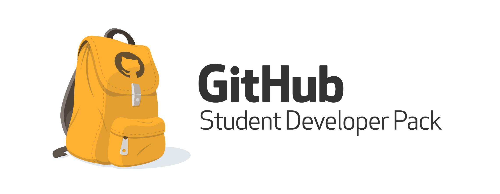

At HackHands, whether it is troubleshooting a bug or getting pair programming mentorship, we want to make it easier for students to learn programming.  We are proud to announce that HackHands has teamed up with GitHub to be included as a top developer tool in their [Student Developer Pack](https://education.github.com/pack). As part of the Student Developer Pack, enrolled students can get $25 in platform credits towards their next live programming session.

Are you a student and want to get started with the Student Developer Pack? Head over to [GitHub Education](https://education.github.com/pack) to enroll so you can claim your pack today.

Already enrolled? [Redeem](http://hackhands.com/education) your free HackHands platform credits.

Happy Hacking!

The HackHands Team
