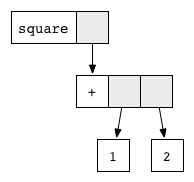
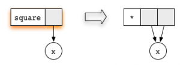
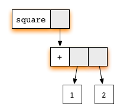
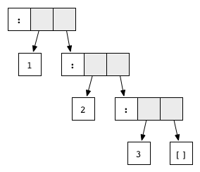
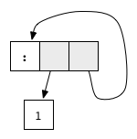
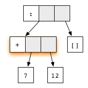
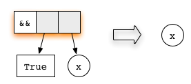
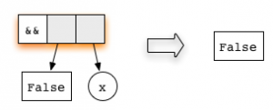
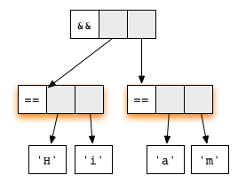
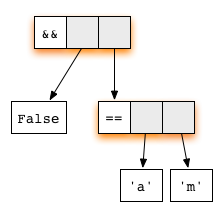

_This tutorial is part of a larger series, [The Incomplete Guide to Lazy Evaluation (in Haskell)](https://hackhands.com/guide-lazy-evaluation-haskell/ "The Incomplete Guide to Lazy Evaluation (in Haskell)")._

# How does Lazy Evaluation work?

_Little Lambda decided to clean up his room at a later time._

Lazy evaluation is the most widely used method for executing Haskell program code on a computer. It can make our code simpler and more modular, but it can also cause confusion when it comes to memory usage, a common pitfall for beginners. For instance, the innocuous looking expression `foldl (+) 0 [1..10^8]` requires gigabytes of memory to evaluate.

In this tutorial, I want to explain how lazy evaluation works and what it means for the time and space usage of a Haskell program. I will begin by explaining the basics of graph reduction and afterwards discuss the strict left fold, a prototypical example for understanding and fixing space leaks.

The topic of lazy evaluation is treated in many textbooks, like Simon Thompson's book ["Haskell -- The Craft of Functional Programming"](http://www.haskellcraft.com/), but information about it still seems to be hard to find online. Hopefully, this tutorial can help.

Lazy evaluation is a trade-off. On one hand, it helps with making our code more modular. (This is the topic of [another tutorial](https://hackhands.com/modular-code-lazy-evaluation-haskell/)) On the other hand, it becomes infeasible to completely understand how evaluation proceeds in a particular program -- it's always a bit different than you think. At the end of the tutorial, I will give pointers on how to deal with this situation. Let us begin!

## Basics: Graph Reduction

### Expressions, graphs and redexes

Haskell programs are executed by evaluating expressions. The main idea behind evaluation is _function application_. Given a function

``` haskell
square x = x*x
```

we can evaluate the expression

``` haskell
square (1+2)
```

by replacing the left-hand side of the definition of `square` with the right-hand side while substituting the variable `x` for the actual argument

``` haskell
square (1+2)
=> (1+2)*(1+2)
```

Evaluation proceeds with the `+` and `*` functions

``` haskell
(1+2)*(1+2)
=> 3*(1+2)
=> 3*3
=> 9
```

Notice that in this case, we somehow ended up evaluating `(1+2)` twice. However, we know that the two expressions `(1+2)` are actually the same, because they correspond to the same function argument `x`.

To avoid this unnecessary duplication, we use a method called **graph reduction**. Every expression can be represented as a graph. Our example is represented as follows

[](assets/blocks-square-0.png)

Every block corresponds to a function application. The function name is written in the white part, and the grey parts point to the function arguments. This graphical notation resembles the way that the compiler actually represents expressions with pointers in memory.

Every function defined by the programmer corresponds to a **reduction rule**. Here, the `square` function corresponds to the rule

[](assets/blocks-square-rule.png)

The circle labelled `x` is a placeholder for a subgraph. Notice how both arguments of the multiplication function point to the same subgraph. Sharing a subgraph in this way is the key to avoiding duplication.

Any subgraph that matches a rule is called a **reducible expression**, or **redex** for short. Whenever we have a redex, we can **reduce** it, that is update the highlighted box according to the rule. In our example expression, we have two redexes: we can reduce the `square` function, or we can reduce the addition (`+`).

[](assets/blocks-square-redex.png)

If we first reduce the redex for the `square` function and then continue evaluation with the redex for addition, we obtain a sequence

[](assets/blocks-square-eval.png)

At every step, we have updated the redex marked in color. In the penultimate graph, a new redex has appeared. It corresponds to the rule for multiplication. Performing the reduction will give the final result `9`.

### Normal form and weak head normal form

Whenever an expression (graph) does not contain any redexes, there is nothing we can reduce anymore, so we are done. When this happens, we say that the expression is in **normal form**. This is the final result of an evaluation. In the previous example, the normal form was a single number, represented by the graph

[](assets/blocks-9.png)

But constructors like `Just`, `Nothing`, as well as the list constructors `:` and `[]` also give rise to normal forms. They do look like functions, but since they were introduced by a `data` declaration and have no right-hand side, there is no reduction rule for them. For instance, the graph

[](assets/blocks-nf-list.png)

is in normal form and represents the list `1:2:3:[]`.

Actually, there are two more requirements for a graph to be in normal form: it must be _finite_ and have _no cycles_. Sometimes, the opposite can happen due to recursion. For instance, the expression defined by

``` haskell
ones = 1 : ones

```

corresponds to the cyclic graph

[](assets/blocks-ones.png)

This graph has no redex, but it is _not_ in normal form because of the cycle: The tail of the list recursively points to the list itself, resulting in an infinite list. As you can see, some expressions just don't have a normal form, they correspond to an infinite loop.

In Haskell, we usually don't evaluate all the way down to normal form. Rather, we often stop once the graph has reached **weak head normal form**, abbreviated WHNF. We say that a graph is in WHNF if its topmost node is a _constructor_. For instance, the expression `(7+12):[]`, or

[](assets/blocks-whnf-list.png)

is in WHNF, because the top node is an application of the list constructor `(:)`. It is not in normal form, because the first argument contains a redex.

On the other hand, any graph that is _not_ in WHNF is called an **unevaluated expression** or **thunk**. An expression that starts with a constructor is in WHNF, but the arguments to this constructor may be unevaluated expressions.

A very interesting example of a graph in WHNF is the expression `ones` that we mentioned above. After all, its topmost node is a constructor. In Haskell, we can represent and manipulate infinite lists! They are great for making code more modular.

### Evaluation order, lazy evaluation

Often, an expression contains multiple redexes. Does it matter in which order we reduce them?

One reduction order, called **eager evaluation**, is to evaluate function arguments to normal form before reducing the function application itself. This is the evaluation strategy chosen by many programming languages.

However, Haskell compilers commonly choose a different reduction order, called **lazy evaluation**, which always tries to reduce the topmost function application first. For that, some function arguments may need to be evaluated, but only as far as necessary. Consider a function that is defined by several equations that use pattern matching. For each equation in turn, the arguments will be evaluated from left to right until their topmost nodes are constructors that match the pattern. If the pattern is a simple variable, then the argument is not evaluated; if the pattern is a constructor, this means evaluation to WHNF.

Hopefully, the concept will become clearer with an example. Let us consider the function `(&&)` which implements a logical AND. Its definition is

``` haskell
(&&) :: Bool -> Bool -> Bool
True  && x = x
False && x = False
```

This definition introduces two reduction rules, depending on whether the first argument is `True` or `False`:

[](assets/and-rule-true.png)

[](assets/and-rule-false.png)

Now, consider the expression

``` haskell
('H' == 'i') && ('a' == 'm')
```

represented as

[](assets/and-expr-0.png)

Both arguments are redexes. The first equation for the function `(&&)` checks whether the first argument matches the constructor `True`. Hence, lazy evaluation will proceed by reducing the first argument:

[](assets/and-expr-1.png)

The second argument is not evaluated, as the topmost function application has already become a redex. Lazy evaluation always tries to reduce the topmost node, so we do that, using the rule for the function `(&&)`, and get

[](assets/and-expr-2.png)

This expression is in normal form, so we are done!

Note that by reducing the application of `(&&)` as soon as possible, we never needed to evaluate the second argument, saving computation time. Some imperative languages use a similar trick, called "[short-circuit evaluation](http://en.wikipedia.org/wiki/Short-circuit_evaluation)". However, this is usually hard-wired into the language and only works for logical operations. In Haskell, it works for all functions and is simply a consequence of lazy evaluation.

In general, a normal form obtained by lazy evaluation never differs from the result obtained by performing eager evaluation on the same expression, so in that sense, it doesn't matter in which order we reduce expressions. However, lazy evaluation uses fewer reduction steps, and it can deal with some cyclic (infinite) graphs that eager evaluation cannot.

### Textual representation

Hopefully, the visual representation of expressions as graphs has helped you to gain a basic understanding of lazy evaluation, in particular because it highlights the concept of a redex and the need for a reduction order. However, for practical calculations, drawing pictures is a bit cumbersome. To trace reductions, we commonly employ a **textual representation** using Haskell syntax.

Graphs make it easy to visualize shared subgraphs. In the textual representation, we have to indicate shared expressions by giving them a _name_ using the `let` keyword. For instance, our very first example of reducing the expression `square (1+2)` becomes

``` haskell
square (1+2)
=>  let x = (1+2) in x*x
=>  let x = 3 in x*x
=>  9
```

The `let … in` syntax allows us to share the subexpression `x = (1+2)`. Note again how lazy evaluation first reduces the `square` function and only then evaluates the argument `x`.

Our second example, the logical AND, becomes

``` haskell
('H' == 'i') && ('a' == 'm')
=>  False && ('a' == 'm')
=>  False
```

In this case, we didn't share any subexpressions, so we didn't need to use the `let` keyword.

From now on, we will use the textual representation.

## Time & Space

We now want to take a look at what lazy evaluation means for the space and time usage of a Haskell program. If you are used only to eager evaluation, there may be some surprises for you, especially when it comes to space usage.

### Time

How many steps does it take to evaluate an expressions? With eager evaluation, the answer is easy: for every function application, we add the time needed to evaluate the arguments to the time needed to evaluate the function body. But for lazy evaluation? Fortunately, the situation for time is very benign, we have the following upper bound:

**Theorem:** _Lazy evaluation never performs more evaluation steps than eager evaluation._

This means that when analyzing the running time of an algorithm, we can always pretend that the arguments are evaluated eagerly. For instance, we can transliterate the code of a sorting algorithm into Haskell and be sure that the result has the same (or in very rare cases a better) algorithmic complexity as its eagerly evaluated counterpart.

That said, the implementation of lazy evaluation does incur a certain administrative overhead. For high performance application, like image processing or numerical simulations, it is beneficial to eschew lazy evaluation and instead stay closer to the metal. Even then, the mantra "simple and modular code" embodied lazy evaluation lives on. For instance, the aim of a compiler optimization called "[stream fusion](http://stackoverflow.com/questions/578063/what-is-haskells-stream-fusion)" is to give high performance array operations a modular, list-like interface. This is implemented in the [vector](http://hackage.haskell.org/package/vector) library.

### Space

Unfortunately, for _space usage_, the situation is not so simple. The core of the problem is that the memory used by an unevaluated expression may differ significantly from the memory used by its normal form. An expression uses as much memory as its graph contains nodes. For instance, the expression

``` haskell
((((0 + 1) + 2) + 3) + 4)
```

takes much more memory to store than its normal form `10`. On the other hand, consider the expression

``` haskell
enumFromTo 1 1000
```

which also has the more familiar syntax `[1..1000]`. This function applications consists of only three nodes and thus takes significantly less memory to store than its normal form, which would be the list `1:2:3:…:1000:[]` containing at least a thousand nodes.

When the first scenario grows out of hand, it is called a **space leak**. The solution is to take control of the evaluation process and make sure that the expression is evaluated sooner. Haskell offers a combinator for this purpose:

``` haskell
seq :: a -> b -> b
```

As the type suggests, this combinator essentially just returns its second argument and behaves much like the `const` function. However, evaluating the expression `seq x y` will first evaluate `x` to WHNF and only then continue with the evaluation of `y`. In contrast, evaluating the expression `const y x` will leave `x` untouched and immediately continue with evaluating `y`.

We will now look at a prototypical example that shows how to use `seq`, and which every Haskell programmer should know about: The **strict left fold**. Consider the task of summing all numbers from `1` to `100`. We express it using an accumulating parameter, i.e. as a left fold

``` haskell
foldl (+) 0 [1..100]
```

For reference, the [foldl](http://www.letu.edu/people/jaytevis/Programming-Languages/Haskell/tourofprelude.html#foldl) function is defined in the [Haskell Prelude](https://www.haskell.org/onlinereport/haskell2010/haskellch9.html) as

``` haskell
foldl :: (a -> b -> a) -> a -> [b] -> a
foldl f a []     = a
foldl f a (x:xs) = foldl f (f a x) xs
```

Evaluation proceeds as follows:

``` haskell
foldl (+) 0 [1..100]
=>  foldl (+) 0 (1:[2..100])
=>  foldl (+) (0 + 1) [2..100]
=>  foldl (+) (0 + 1) (2:[3..100])
=>  foldl (+) ((0 + 1) + 2) [3..100]
=>  foldl (+) ((0 + 1) + 2) (3:[4..100])
=>  foldl (+) (((0 + 1) + 2) + 3) [4..100]
=>  …
```

As you can see, the accumulating parameter grows and grows without bounds -- a space leak. The solution is to make sure that the accumulating parameter is always in WHNF. The following modification of the `foldl` function will do the trick:

``` haskell
foldl' :: (a -> b -> a) -> a -> [b] -> a
foldl' f a []     = a
foldl' f a (x:xs) = let a' = f a x
                    in seq a' (foldl' f a' xs)
```

It can be found in the [Data.List](http://hackage.haskell.org/package/base-4.7.0.1/docs/Data-List.html#v:foldl-39-) module. Now, evaluation proceeds like this

``` haskell
foldl' (+) 0 [1..100]
=>  foldl' (+) 0 (1:[2..100])
=>  let a' = 0 + 1 in seq a' (foldl' (+) a' [2..100])
=>  let a' = 1 in seq a' (foldl' (+) a' [2..100])
=>  foldl' (+) 1 [2..100]
=>  foldl' (+) 1 (2:[3..100])
=>  let a' = 1 + 2 in seq a' (foldl' (+) a' [3..100])
=>  let a' = 3 in seq a' (foldl' (+) a' [3..100])
=>  foldl' (+) 3 [3..100]
=>  …
```

During the course of the evaluation, the expression stays at a constant size. Using `seq` makes sure that the accumulating parameter is evaluated to WHNF before the next element in the list is considered.

As a rule of thumb, the function `foldl` is prone to space leaks. You should use `foldl'` or `foldr` instead.

By the way, note that in a language with eager evaluation, you would never write the code above for the task of summing the numbers from `1` to `100`. After all, an eagerly evaluated language would first evaluate the list `[1..100]` to normal form, which would use just as much space as the inefficient version with `foldl`. To solve the task efficiently, you would have to write a recursive loops. But in Haskell, lazy evaluation allows us to solve the task by applying general purpose list combinators to the list `[1..100]`, which is evaluated "on demand". This is an example where it makes our code more modular.

There is another important lesson to learn from this example: The evaluation I showed is not entirely accurate. If we define list enumeration `[n..m]` as

``` haskell
enumFromTo n m = if n < m then n : enumFromTo (n+1) m else []
```

then the reduction to WHNF is really

``` haskell
[1..100]
=>  1 : [(1+1)..100]
```

where the new first argument is not `2`, but the unevaluated expression `(1+1)`. This doesn't make much difference here, but the point is that you have to very careful if you want to trace lazy evaluation precisely -- it never quite does what you think it does. The actual [source code for enumFromTo](https://www.haskell.org/onlinereport/haskell2010/haskellch9.html#verbatim-226) is even more different. In particular, note that `[1..]` will build a list of numbers that are _not_ in WHNF.

In fact, I would go so far as to say that with lazy evaluation, it is no longer feasible to trace evaluation in detail, except for very simple examples. Thus, analyzing the space usage of a Haskell program can be hard. My advice would be to only act when your program really does have a significant space leak, in which case I recommend [profiling tools](http://stackoverflow.com/a/3276557/403805) to find out what's going on. Once the problem is identified, tools like [space invariants](http://apfelmus.nfshost.com/blog/2013/08/21-space-invariants.html) and `seq` can guarantee that the relevant expressions are in WHNF, regardless of how lazy evaluation proceeds in minute detail.

This is all I wanted to say about lazy evaluation and space usage for today. One other important example of a space leak that I didn't talk about, but which is also prototypical, is the following:

``` haskell
let small' = fst (small, large) in … small' …
```

The expression `small'` keeps a reference to the expression `large`, even though the function `fst` will discard it. You should probably evaluate the expression `small'` to WHNF at some point so that the memory taken by `large` can be released.
